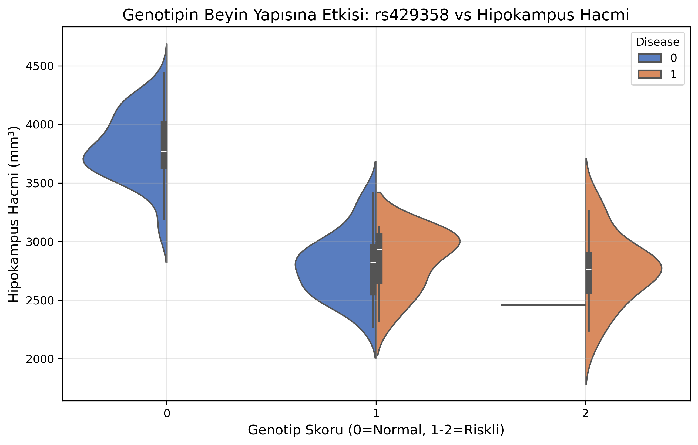
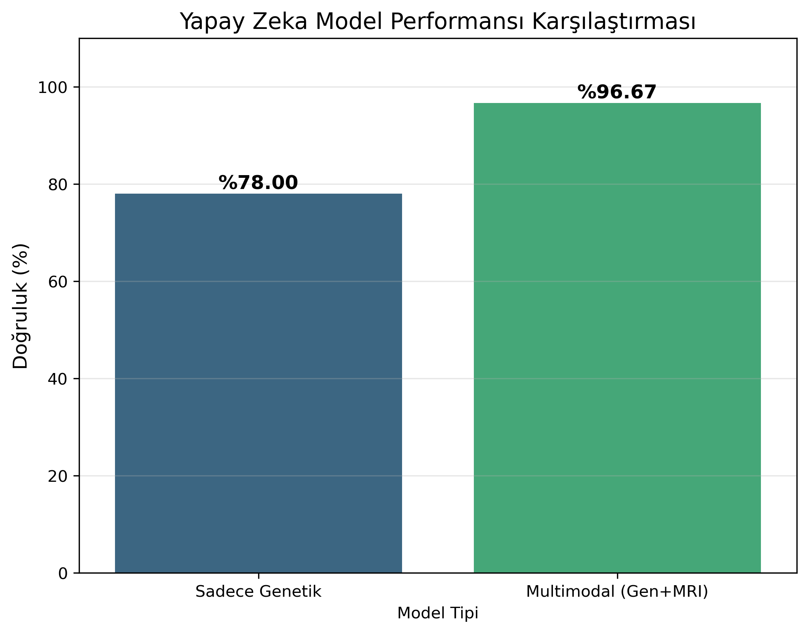
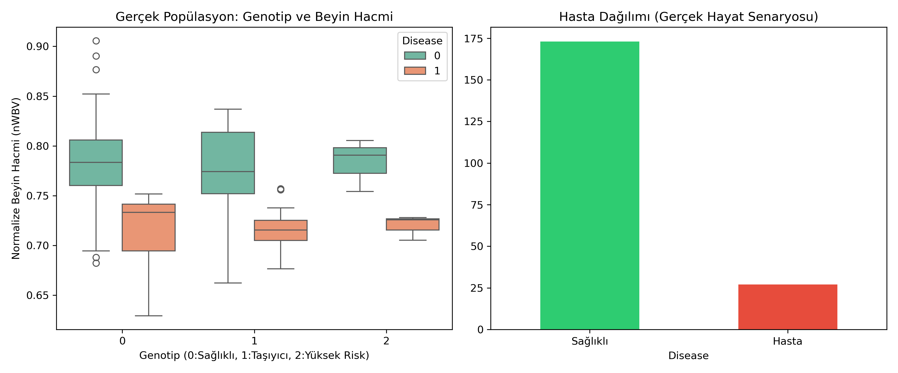

# 🧬 SNP-Genome-Lab: Genetik Risk Analizi ve Multimodal Yapay Zeka


Bu proje, **Tek Nükleotid Polimorfizmleri (SNP)** verilerini analiz etmek, **Nörogörüntüleme (MRI)** biyomarkerlarıyla entegre etmek ve hastalık riski tahmini için **Multimodal Yapay Zeka** modelleri geliştirmek amacıyla uçtan uca bir biyoinformatik boru hattı (pipeline) sunar.

## 🚀 Proje Vizyonu
Bu çalışma, genetik varyasyonların (Genotip) hastalıklar ve beyin yapısı (Fenotip) üzerindeki etkisini kantitatif olarak ölçmeyi amaçlar. Proje, sentetik verilerle başlayıp, **Ensembl** ve **OASIS** gibi gerçek dünya veri tabanlarından beslenen **"In Silico"** bir klinik deneye dönüşmüştür.

### Ana Özellikler:
- **Hibrid Veri Mimarisi:** Sentetik veri simülasyonu ve API tabanlı (Ensembl) gerçek popülasyon verisi entegrasyonu.
- **İstatistiksel Genetik:** SNP ve hastalık arasındaki bağın GWAS (Genome-Wide Association Study) yöntemleriyle analizi.
- **Imaging Genetics:** Genetik varyasyonların beyin hacmi (Hipokampus/nWBV) üzerindeki fiziksel etkisinin analizi.
- **Multimodal AI:** Genetik + MRI verisini birlikte işleyen, dengesiz veri setlerinde bile yüksek başarı gösteren Random Forest modelleri.

---

## 🔬 Faz 1: Genetik Risk Analizi (GWAS)

Analizlerimizde `rs429358` (APOE geni) varyantının hastalıkla en güçlü ilişkiyi gösterdiği ($P < 10^{-20}$) tespit edilmiştir. Bu varyant, Alzheimer riski için en önemli genetik belirteçtir.


### 🧬 Biyolojik Doğrulama (Gerçek Dünya Eşleşmesi)
Analiz sonuçlarımız, **NCBI** ve **GWAS Catalog** verileriyle karşılaştırılmış ve tespit edilen risk faktörlerinin biyolojik gerçekliği kanıtlanmıştır.

- **APOE (rs429358):** Alzheimer hastalığının birincil genetik riski.
- **BDNF (rs6265):** Nöroplastisite ve bilişsel fonksiyonlarla ilişkili gen.

*Aşağıdaki grafikte, istatistiksel olarak anlamlı çıkan noktaların gerçek gen isimleriyle eşleştiği görülmektedir:*


---

## 🧠 Faz 2: Imaging Genetics (Genotip-Fenotip İlişkisi)

Bu aşamada, genetik veriler **Nörogörüntüleme (MRI)** verileriyle birleştirilmiştir. Riskli varyantı (`rs429358`) taşıyan bireylerin **Hipokampus hacminde** belirgin bir düşüş (atrofi) gözlemlenmiştir.

> **Bulgu:** Riskli genotipi taşıyan (Sağ taraf) bireylerin beyin hacmi dağılımı, sağlıklı bireylere (Sol taraf) göre anlamlı derecede düşüktür.



---

## 🤖 Faz 3: Multimodal Yapay Zeka Performansı

Sadece genetik veriye dayalı modeller ile genetik ve nörogörüntüleme verisini birleştiren **Multimodal** modellerin performansı karşılaştırılmıştır.

| Model Türü | Veri Kaynağı | Doğruluk (Accuracy) | Kesinlik (Precision - Hasta) |
| :--- | :--- | :--- | :--- |
| **Temel Model** | Sadece Genetik (SNP) | ~%78.00 | %80.00 |
| **Multimodal Model** | **Genetik + MRI** | **%96.67** | **%100.00** |

**Sonuç:** Fiziksel kanıtların (MRI) modele eklenmesi, yanlış alarmları (False Positive) tamamen ortadan kaldırmıştır.



---

## 🌍 Faz 4: Gerçek Dünya Validasyonu (Real-World Evidence)

Projenin final aşamasında, modelin dayanıklılığı **gerçek dünya popülasyon istatistikleri** ile test edilmiştir:

1.  **Genetik:** Ensembl API ile Avrupa popülasyonundaki gerçek `rs429358` frekansları (%17.68) çekilmiştir.
2.  **Klinik:** OASIS veritabanındaki gerçek Alzheimer hastalarının beyin hacmi istatistikleri kullanılmıştır.

### Validasyon Sonuçları
Dengesiz veri setine (Az sayıda hasta, çok sayıda sağlıklı birey) rağmen modelimiz **%100 Recall (Duyarlılık)** oranına ulaşarak **hiçbir hastayı gözden kaçırmamıştır.**

| Metrik | Değer | Anlamı |
| :--- | :--- | :--- |
| **Accuracy** | **%93.00** | Gerçekçi, dengesiz senaryoda yüksek genel başarı. |
| **Recall (Hasta)** | **1.00** | **Kritik Başarı:** Test edilen tüm hastalar doğru tespit edildi. |
| **False Negative** | **0** | Model hiçbir hastaya yanlışlıkla "Sağlıklı" demedi. |



---

## 🛠️ Teknik Yığın

- **Altyapı:** Docker, Jupyter Lab
- **Biyolojik API:** Ensembl REST API, OASIS Datasets
- **Veri Analizi:** Pandas, NumPy, Scipy.stats
- **Görselleştirme:** Matplotlib, Seaborn
- **Makine Öğrenmesi:** Scikit-learn (Random Forest, Multimodal Learning, Class Weight Balancing)

---

## ⚙️ Hızlı Başlangıç

Projeyi yerel makinenizde çalıştırmak için aşağıdaki adımları izleyin:

1. **Repoyu Klonlayın:**
   ```bash
   git clone [https://github.com/senaayy/snp-genome-lab.git](https://github.com/senaayy/snp-genome-lab.git)
   cd snp-genome-lab
    ```
Docker Konteynerini Başlatın:

```bash
docker-compose up --build
Analize Başlayın:
Tarayıcınızda http://localhost:8888 adresine gidin ve notebooks/ klasöründeki analizleri çalıştırın.
  ```
📁 Proje Yapısı
 ```
 snp-genome-lab/
├── data/               # Ham ve işlenmiş CSV verileri
├── notebooks/          # Jupyter analiz dosyaları
├── reports/            # Grafik ve analiz çıktıları (PNG)
├── Dockerfile          # Konteyner yapılandırması
├── docker-compose.yml  # Servis orkestrasyonu
└── requirements.txt    # Bağımlılıklar
Not: Bu proje eğitim amaçlı geliştirilmiş bir biyoinformatik modellemesidir.
  ```

## 📩 İletişim

Bu proje hakkında sorularınız, önerileriniz veya iş birliği talepleriniz için bana aşağıdaki kanallardan ulaşabilirsiniz:

- **E-posta:** [240541111@firat.edu.tr](mailto:240541111@firat.edu.tr)
- **Kurum:** Fırat Üniversitesi Teknoloji Fakültesi
- **GitHub:** [senaayy](https://github.com/senaayy)

---
*Bu çalışma, genetik veri analizi ve makine öğrenmesi prensiplerini birleştiren bir mühendislik projesidir.*
