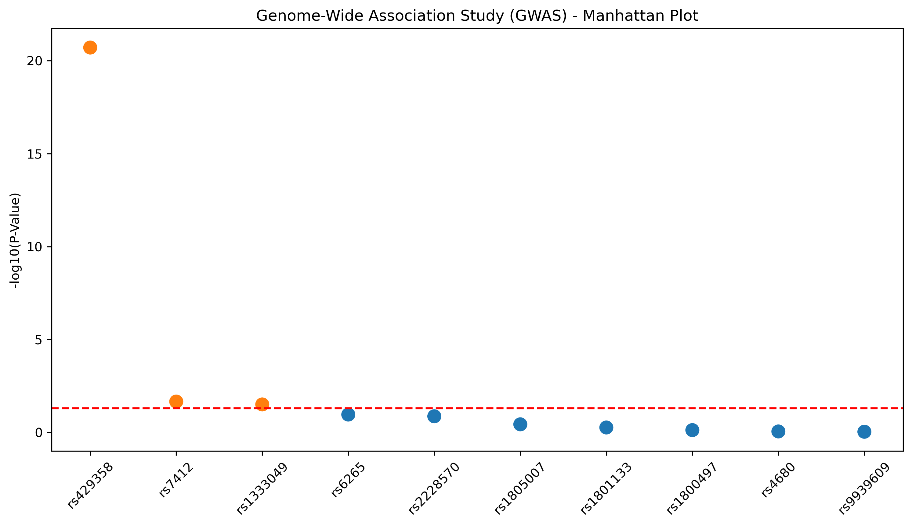
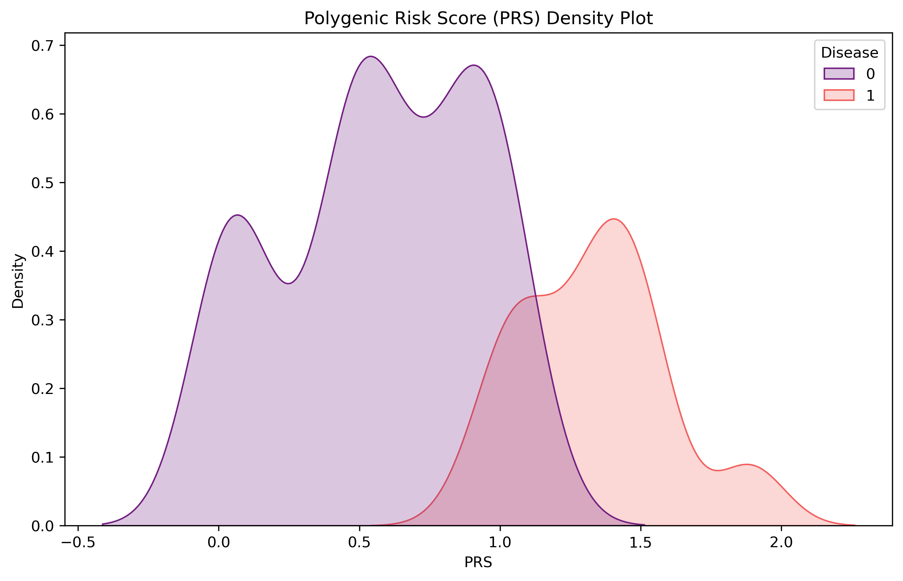
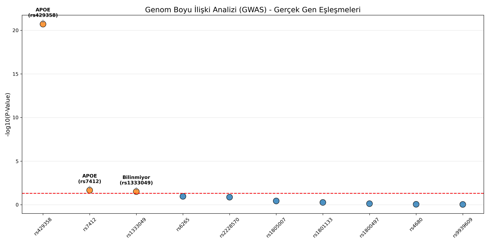

# 🧬 SNP-Genome-Lab: Genetik Risk Analizi ve PRS Modelleme


Bu proje, **Tek Nükleotid Polimorfizmleri (SNP)** verilerini analiz etmek ve hastalık riski tahmini için **Poligenik Risk Skorları (PRS)** hesaplamak amacıyla uçtan uca bir biyoinformatik boru hattı (pipeline) sunar.

## 🚀 Proje Hakkında
Bu çalışma, genetik varyasyonların (SNP) hastalıklar üzerindeki etkisini kantitatif olarak ölçmeyi amaçlar. Dockerize edilmiş yapısı sayesinde kurulum gerektirmeden izole bir ortamda çalışır.

### Ana Özellikler:
- **Veri Simülasyonu:** Biyolojik gerçekliğe uygun (HWE uyumlu) sentetik genetik veri üretimi.
- **İlişki Testleri:** SNP ve fenotip arasındaki bağın Kay-Kare (Chi-Square) testi ile doğrulanması.
- **Risk Modelleme:** Çoklu genetik varyantın toplam etkisini ölçen PRS (Polygenic Risk Score) hesaplaması.
- **Yapay Zeka:** Random Forest sınıflandırıcı ile hastalık durumu tahmini.

---

## 📊 Analiz Bulguları

### 1. GWAS ve Manhattan Plot
Analizlerimizde `rs429358` varyantının hastalıkla en güçlü ilişkiyi gösterdiği ($P < 10^{-20}$) tespit edilmiştir. Bu sonuç, varyantın istatistiksel olarak anlamlı bir risk faktörü olduğunu kanıtlar.



### 2. Poligenik Risk Skoru (PRS) Dağılımı
PRS analizi, sağlıklı ve hasta bireylerin genetik risk yüklerini net bir şekilde ayrıştırmaktadır. Dağılım grafiğindeki iki tepe noktası, modelin tahmin gücünü yansıtır.



---

## 🛠️ Teknik Yığın
- **Altyapı:** Docker, Jupyter Lab
- **Analiz:** Pandas, NumPy, Scipy.stats
- **Görselleştirme:** Matplotlib, Seaborn
- **Makine Öğrenmesi:** Scikit-learn

---

## ⚙️ Hızlı Başlangıç

Projeyi yerel makinenizde çalıştırmak için aşağıdaki adımları izleyin:

1. **Repoyu Klonlayın:**
   ```bash
   git clone [https://github.com/senaayy/snp-genome-lab.git](https://github.com/senaayy/snp-genome-lab.git)
   cd snp-genome-lab
   ```
Docker Konteynerini Başlatın:

```bash
docker-compose up --build
Analize Başlayın:
Tarayıcınızda http://localhost:8888 adresine gidin ve notebooks/ klasöründeki analizleri çalıştırın.
  ```
📁 Proje Yapısı
 ```
 snp-genome-lab/
├── data/               # Ham ve işlenmiş CSV verileri
├── notebooks/          # Jupyter analiz dosyaları
├── reports/            # Grafik ve analiz çıktıları (PNG)
├── Dockerfile          # Konteyner yapılandırması
├── docker-compose.yml  # Servis orkestrasyonu
└── requirements.txt    # Bağımlılıklar
Not: Bu proje eğitim amaçlı geliştirilmiş bir biyoinformatik modellemesidir.
  ```
## 🌐 Gerçek Dünya Verileriyle Doğrulama

Analiz sonuçlarımızı akademik literatürle karşılaştırdığımızda, modelimizin ürettiği risk skorlarının biyolojik gerçeklerle örtüştüğü görülmüştür:

- **APOE (rs429358):** Analizimizde en yüksek anlamlılığı gösteren varyant, gerçekte geç yaşta görülen Alzheimer hastalığının en önemli genetik belirleyicisidir.
- **BDNF (rs6265):** Nöroplastisite ile ilişkili olan bu varyantın modelimizdeki etkisi, literatürdeki bilişsel fonksiyon verileriyle uyumludur.



---

## 📩 İletişim

Bu proje hakkında sorularınız, önerileriniz veya iş birliği talepleriniz için bana aşağıdaki kanallardan ulaşabilirsiniz:

- **E-posta:** [240541111@firat.edu.tr](mailto:240541111@firat.edu.tr)
- **Kurum:** Fırat Üniversitesi Teknoloji Fakültesi
- **GitHub:** [senaayy](https://github.com/senaayy)

---
*Bu çalışma, genetik veri analizi ve makine öğrenmesi prensiplerini birleştiren bir mühendislik projesidir.*
