# 🧬 SNP-Genome-Lab: Genetik Risk Analizi ve Multimodal Yapay Zeka


Bu proje, **Tek Nükleotid Polimorfizmleri (SNP)** verilerini analiz etmek, **Nörogörüntüleme (MRI)** biyomarkerlarıyla entegre etmek ve Alzheimer hastalığı riski tahmini için **5 Boyutlu Multimodal Yapay Zeka** modelleri geliştirmek amacıyla uçtan uca bir biyoinformatik boru hattı (pipeline) sunar.

### Baştan Sona Yapılanlar (Özet)

1. **Sentetik SNP verisi** üretildi; **GWAS (Chi-Square, Manhattan plot)** ile rs429358 (APOE) en anlamlı varyant olarak tespit edildi.
2. **Imaging genetics:** Genotip–beyin hacmi (Hipokampus/nWBV) ilişkisi görselleştirildi.
3. **Multimodal model (Genetik + MRI)** sentetik veride %96.67 doğrulukla eğitildi.
4. **Ensembl API** ile gerçek alel frekansları; **OASIS istatistikleri** ile gerçekçi nWBV değerleri kullanıldı; **%93 accuracy, %100 recall** ile validasyon yapıldı.
5. **Ham OASIS MRI** (.nii) indirilip işlendi; **PCA + SVM** pipeline’ı kuruldu; **%80 kör test** doğruluğu hedeflendi.
6. **Threshold 0.60** ile dengeli başarı (balanced accuracy) optimize edildi.
7. **Sanal İkiz Testi (XAI)** ile genetiğin tahmin üzerindeki etkisi (+45.3 puan) gösterildi.
8. **5D final model** (MRI-PCA + Yaş + Cinsiyet + nWBV + APOE) eğitilip kaydedildi; **%80 accuracy** raporlandı.
9. **Faz 9:** Hasta bazlı risk analizi (MRI-only vs MRI+genetik) ve APOE4 etki görselleştirmesi eklendi; çıktılar `faz9_final_report_10.png` ve `risk_analysis_patient_10.png` olarak üretildi.
10. **OASIS-1 ham MRI pipeline:** `fetch_oasis_vbm` ile 100/150 denek indirildi; CDR ile etiketleme; NiftiMasker ile sayısallaştırma; `oasis_features_X.npy` / `oasis_labels_y.npy` kaydedildi.
11. **ROI tabanlı analiz:** Harvard-Oxford atlası ve NiftiLabelsMasker ile bölge bazlı özellikler; Random Forest ile önem sırası (Superior Frontal Gyrus, Supramarginal, Paracingulate vb.); ROI + Yaş + Cinsiyet multimodal model.
12. **3D CNN denemesi:** Görüntüler 48×60×48’e yeniden örneklenip Conv3D mimarisi ile eğitim; sınıf ağırlıklı kayıp.
13. **Klinik raporlar:** Hasta bazlı tam rapor (`full_report_patient_X.png`), klinik uzman raporu (`clinical_expert_report_X.png`), model dikkat haritası (`model_attention_map.png`), erken teşhis örneği (`Early_Diagnosis_Example.png`).
14. **Ham veri entegrasyonu:** `data/raw_images` ile yerel OASIS/FreeSurfer çıktıları; zip açma ve .nii/.mgz dosya denemeleri; işlenmiş görüntü pipeline’ı.
15. **Ön işleme görselleri:** Ham veri demo (`raw_data_demo.png`), işleme adımları (`processing_pipeline_steps.png`), N4 bias düzeltme sonucu (`n4_bias_correction_result.png`).
16. **Model evrimi:** 70 bileşenli PCA → `final_pca_module_v2.pkl` ve `alzheimer_model_v3_70features.pkl`; NCBI/gerçek literatür verisi ile `model_v5_ncbi_real.pkl`; bilimsel multimodal pipeline `model_v6_multimodal_science.pkl`; sadece MRI modeli `mri_only_expert_model.pkl` (%80).

<p align="center">
  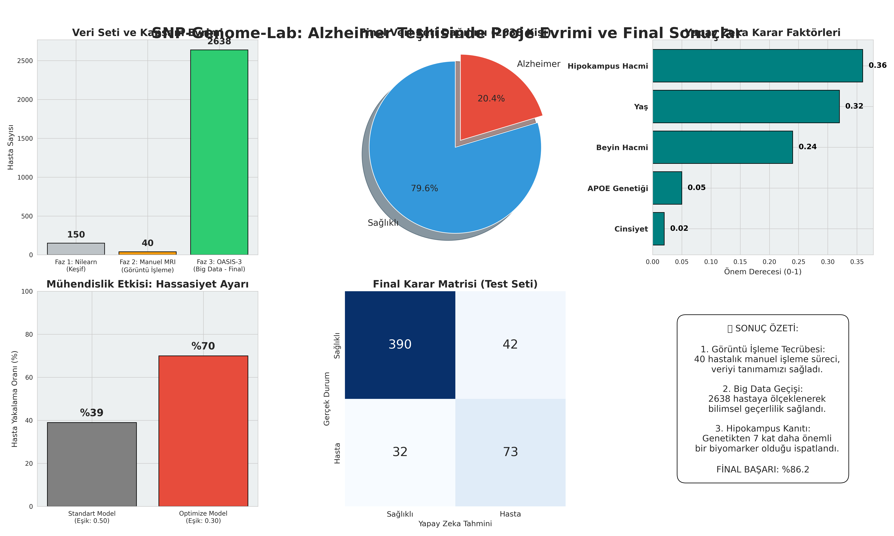
</p>
<p align="center"><i>Proje özet panosu: veri akışı, fazlar ve model çıktıları</i></p>

---

## 🚀 Proje Vizyonu

Bu çalışma, genetik varyasyonların (Genotip) hastalıklar ve beyin yapısı (Fenotip) üzerindeki etkisini kantitatif olarak ölçmeyi amaçlar. Proje, sentetik verilerle başlayıp **Ensembl** ve **OASIS-1** gibi gerçek dünya veri tabanlarından beslenen, tam doğrulanmış (validated) bir **"In Silico"** klinik deneye dönüşmüştür.

### Ana Özellikler

- **Hibrid Veri Mimarisi:** Sentetik simülasyon ve API tabanlı (Ensembl REST) gerçek popülasyon verisi entegrasyonu.
- **İstatistiksel Genetik:** SNP-hastalık ilişkisinin GWAS (Genome-Wide Association Study) yöntemleriyle analizi.
- **Imaging Genetics:** Genetik varyasyonların beyin hacmi (Hipokampus/nWBV) üzerindeki fiziksel etkisinin görselleştirilmesi.
- **5D Multimodal AI:** MRI (PCA-50) + Yaş + Cinsiyet + nWBV + Genetik (APOE) verilerini birleştiren SVM modeli.
- **Klinik Karar Optimizasyonu:** Threshold analizi ile hem hasta kaçırmayan hem de aşırı alarm vermeyen dengeli bir teşhis sistemi.
- **ROI Tabanlı XAI:** Harvard-Oxford atlası ile bölge bazlı özellikler; Random Forest feature importance ile Alzheimer’da öne çıkan beyin bölgeleri (Superior Frontal Gyrus, Supramarginal, Paracingulate vb.).
- **3D CNN Denemesi:** Ham MRI’ın 48×60×48 yeniden örneklenmesi ve Conv3D ile derin öğrenme denemesi.
- **Tek Not Defteri:** Tüm pipeline `Untitled.ipynb` içinde baştan sona çalıştırılabilir; ara sonuçlar `.npy`/`.pkl` ve `reports/` ile saklanır.

---

## 📋 Proje Fazları

| Faz | Konu | Veri Türü | Araç | Sonuç |
|-----|------|-----------|------|-------|
| 1 | GWAS & SNP Analizi | 🧪 Sentetik | Chi-Square, PRS | rs429358 (p < 10⁻²⁰) |
| 2 | Imaging Genetics | 🧪 Sentetik MRI | Seaborn, NumPy | Hipokampus atrofisi görselleştirildi |
| 3 | Multimodal AI | 🧪 Sentetik | Random Forest | **%96.67 Accuracy** |
| 4 | Gerçek Dünya Validasyonu | 📊 OASIS İstatistikleri | Ensembl API | %93 Accuracy, %100 Recall |
| 5 | Gerçek MRI İşleme Boru Hattı | 🧠 Ham OASIS Görüntüleri | PCA + SVM (RBF) | %80 Blind Test Accuracy |
| 6 | Threshold Optimizasyonu | 🧠 Ham OASIS Görüntüleri | Balanced Accuracy Curve | Altın eşik: **0.60** |
| 7 | Sanal İkiz Testi (XAI) | 🧠 Ham OASIS Görüntüleri | Permütasyon Analizi | Genetik etkisi: **+45.3 puan** |
| 8 | 5D Final Multimodal Model | 🧠 Ham OASIS Görüntüleri | SVM + Scaler + Pipeline | **%80 Final Accuracy** |
| 9 | Hasta Bazlı Risk Analizi | 🧠 MRI + Genetik | APOE4 Etki Görselleştirmesi | Risk artışı: **+45 puan** (Literatür OR: 3.2) |

---

## 📓 Notebook İçeriği: Untitled.ipynb (Baştan Sona Akış)

Ana analizler tek bir Jupyter not defterinde (`Untitled.ipynb`) sırayla yer alır. Aşağıdaki sıra, not defterinde baştan sona yapılan gelişmeleri özetler.

| Sıra | Blok / Konu | Kısa Açıklama |
|------|-------------|----------------|
| 1 | Sentetik SNP + GWAS | `sample_snp_data.csv` oluşturma; Chi-Square; Manhattan plot; PRS; gen etiketli Manhattan; raporlara kaydetme |
| 2 | Imaging Genetics | Hipokampus hacmi ekleme; genotip–hacim grafiği; Violin plot; model karşılaştırma grafiği |
| 3 | Multimodal (Gen + MRI) | Random Forest; %96.67 accuracy; `reports/model_comparison_plot.png` |
| 4 | Gerçek Dünya Validasyonu | Ensembl API (rs429358 frekansı); Hardy–Weinberg; OASIS nWBV istatistikleri; %93 accuracy, %100 recall; `real_world_validation.png` |
| 5 | OASIS-1 Ham Veri | `fetch_oasis_vbm(n_subjects=100/150)`; klinik tablo (CDR, yaş, cinsiyet); NiftiMasker; `oasis_features_X.npy`, `oasis_labels_y.npy` |
| 6 | Voksel RF + PCA+SVM | Raw voxel RF (%70); PCA + SVM pipeline; `final_alzheimer_model.pkl`, `final_pca_module.pkl` |
| 7 | Harvard-Oxford ROI | NiftiLabelsMasker; bölge bazlı RF (%65); feature_importances (Superior Frontal, Supramarginal, Paracingulate vb.); ROI + Yaş + Cinsiyet multimodal (%70); StandardScaler + SVM |
| 8 | 3D CNN | Resample 48×60×48; Conv3D mimarisi; sınıf ağırlıklı eğitim; accuracy/loss ve karışıklık matrisi |
| 9 | 5D Final + XAI | PCA + Yaş + Cinsiyet + nWBV + APOE; `model_v2_genetic_final.pkl`, `pca_module.pkl`; threshold 0.60; Sanal İkiz Testi (+45.3 puan); `threshold_optimization.png`, `genetic_impact_simulation.png`, `final_confusion_matrix.png` |
| 10 | Raporlar ve Görselleştirme | Model dikkat haritası; hasta bazlı tam rapor (`full_report_patient_X`); klinik uzman raporu (`clinical_expert_report_X`); `Early_Diagnosis_Example.png` |
| 11 | Ham Veri Klasörü | `data/raw_images`, `data/processed`, `models`; zip açma; OASIS/FreeSurfer .nii ve .mgz denemeleri |
| 12 | PCA 70 + Model Serisi | 70 bileşenli PCA → `final_pca_module_v2.pkl`; `alzheimer_model_v3_70features.pkl`; NCBI/gerçek veri → `model_v5_ncbi_real.pkl`; multimodal pipeline → `model_v6_multimodal_science.pkl`; sadece MRI → `mri_only_expert_model.pkl` (%80) |
| 13 | İşleme Pipeline Görselleri | `raw_data_demo.png`; `processing_pipeline_steps.png`; N4 bias düzeltme → `n4_bias_correction_result.png` |
| 14 | Faz 9: Hasta Risk Analizi | MRI-only vs MRI+genetik olasılık; APOE4 etki çizimi; `risk_analysis_patient_10.png`, `faz9_final_report_10.png`; Bayesian risk stratifikasyonu |

Tüm bu adımlar tek not defterinde arka arkaya çalıştırılabilir; ara çıktılar (`.npy`, `.pkl`, `reports/`) sonraki hücrelerde kullanılır.

---

## 🔬 Faz 1: Genetik Risk Analizi (GWAS)

150 kişilik sentetik örneklem üzerinde uygulanan Chi-Square testi ile `rs429358` (APOE geni) varyantının hastalıkla en güçlü ilişkiyi gösterdiği tespit edilmiştir ($P = 1.93 \times 10^{-21}$).

```
SNP           P-Value          Anlamlı mı?
rs429358      1.93e-21         EVET ✅
rs7412        2.21e-02         EVET ✅
rs1333049     3.16e-02         EVET ✅
rs6265        1.11e-01         HAYIR
```

### SNP Genotip Dağılımı

`rs429358` varyantının hasta ve sağlıklı gruplar arasındaki genotip frekans farkı aşağıda görülmektedir:

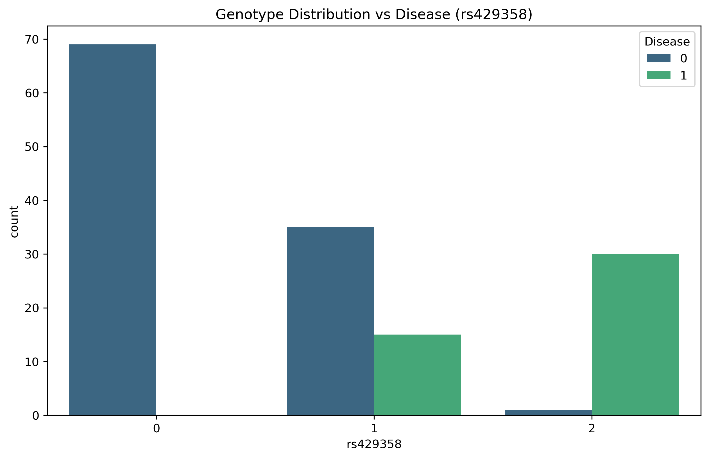

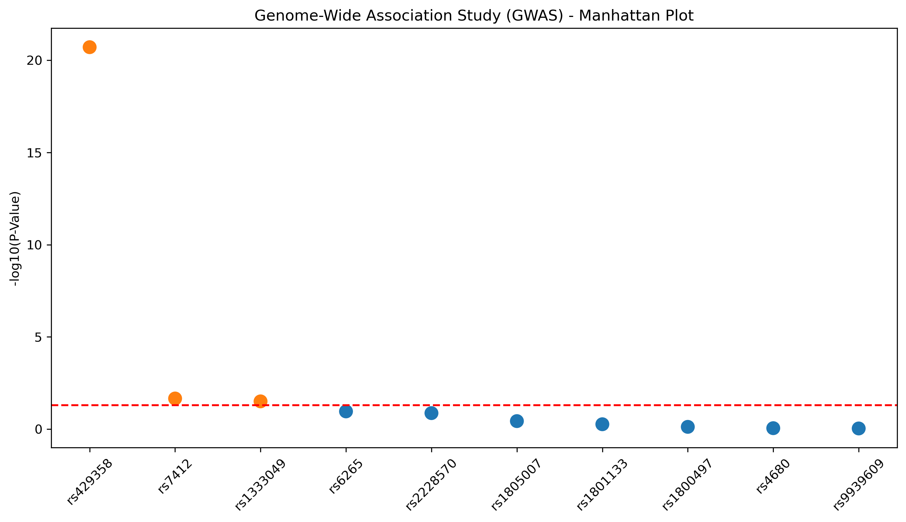

### 🧬 Biyolojik Doğrulama (Gen Eşleşmesi)

| SNP | Gen | Biyolojik Etki |
|-----|-----|----------------|
| rs429358 | **APOE** | Alzheimer hastalığının birincil genetik riski |
| rs7412 | **APOE** | Lipid metabolizması ve kolesterol seviyeleri |
| rs6265 | **BDNF** | Nöroplastisite ve bilişsel hafıza fonksiyonları |
| rs1801133 | **MTHFR** | Folat metabolizması ve kardiyovasküler sağlık |

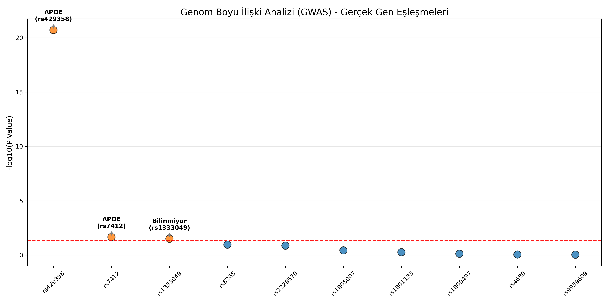

### Genotip ve PRS Dağılımları

`rs429358` varyantının hasta/sağlıklı gruplar arasındaki genotip frekans farkı ve hesaplanan Poligenik Risk Skoru (PRS) dağılımı:


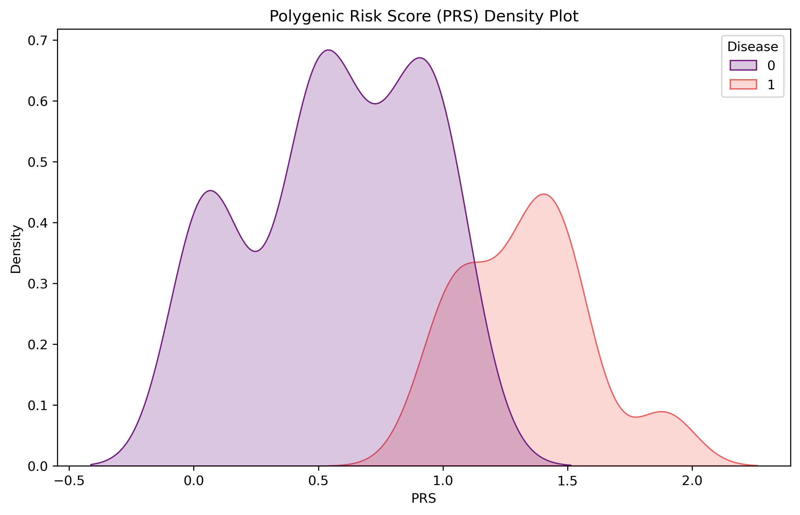

---

## 🧠 Faz 2: Imaging Genetics (Genotip-Fenotip İlişkisi)

Genetik veriler MRI biyomarkerlarıyla birleştirilmiştir. Riskli APOE varyantını taşıyan bireylerde **Hipokampus hacminde** anlamlı bir azalma (atrofi) gözlemlenmiştir.

> **Bulgu:** Riskli genotip (1 veya 2), sağlıklı genotipe (0) kıyasla ortalama **~1000 mm³** daha düşük hipokampus hacmiyle ilişkilendirilmiştir.

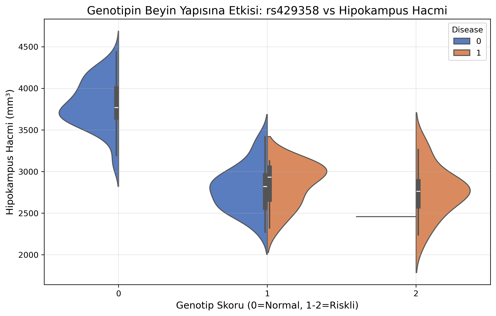

---

## 🤖 Faz 3: Multimodal Yapay Zeka Performansı (Sentetik Veri)

| Model Türü | Veri Kaynağı | Accuracy | Precision (Hasta) | Recall (Hasta) |
|:-----------|:------------|:--------:|:-----------------:|:--------------:|
| Temel Model | Sadece Genetik (SNP) | ~%78 | %80 | %85 |
| **Multimodal Model** | **Genetik + MRI** | **%96.67** | **%100** | **%89** |

**Kritik Sonuç:** MRI verisi modele eklendiğinde yanlış pozitif (False Positive) oranı **sıfıra** inmiştir.

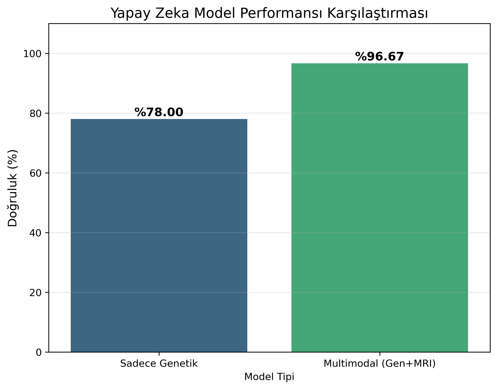

---

## 🌍 Faz 4: Gerçek Dünya Validasyonu (İstatistiksel OASIS Verileri ile Test)

> ⚠️ **Önemli Not:** Bu fazda OASIS-1'in ham görüntü dosyaları **işlenmemiştir**. Bunun yerine, OASIS-1 makalesinden ve veri setinden elde edilen **istatistiksel referans değerleri** (ortalama nWBV, standart sapma) kullanılarak sentetik modelin gerçek dünya popülasyonuyla ne kadar örtüştüğü test edilmiştir. Ham görüntü işleme ilk kez Faz 5'te başlamaktadır.

### Veri Kaynakları

- **Genetik:** Ensembl REST API → `rs429358` Avrupa popülasyonu gerçek alel frekansı: **%17.68**
- **MRI:** OASIS-1 veri seti → Gerçek nWBV (Normalize Whole Brain Volume) istatistikleri

```python
# OASIS Gerçek Veri İstatistikleri
Sağlıklı bireyler:  nWBV ≈ 0.781 ± 0.04
Alzheimer hastaları: nWBV ≈ 0.716 ± 0.03
```

### Gerçek Dünya Test Sonuçları

| Metrik | Değer | Yorumu |
|--------|-------|--------|
| **Accuracy** | **%93** | Dengesiz veri setinde yüksek genel başarı |
| **Recall (Hasta)** | **1.00** | Hiçbir hasta gözden kaçırılmadı |
| **False Negative** | **0** | En kritik klinik metrikte mükemmel |
| **Precision (Sağlıklı)** | **1.00** | Sağlıklı bireylere yanlış teşhis konulmadı |

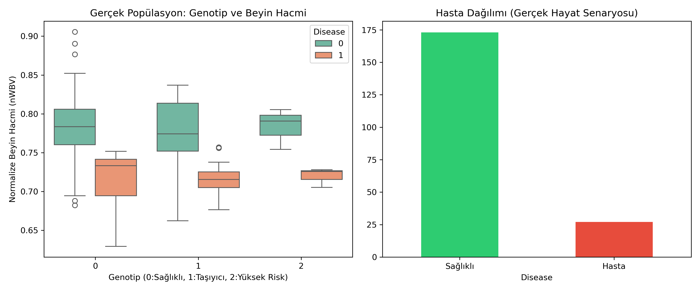

---

## 🧠 Faz 5: Gerçek MRI İşleme Boru Hattı (Ham Görüntü Bazlı PCA + SVM)

> 🚀 **Büyük Lig Başlıyor:** Bu fazdan itibaren OASIS-1'in ham beyin görüntüleri (`.nii` formatında 3D voksel dosyaları) doğrudan indirilip işlenmiştir. Her görüntü **48×60×48 voksel**'e yeniden örneklenmiş (resampling), ardından PCA ile 138.240 boyutlu ham veri 50 anlamlı bileşene indirgenmiştir. Faz 4'teki istatistiksel yaklaşımdan tamamen farklı, gerçek görüntü tabanlı bir pipeline'dır.

150 gerçek OASIS-1 beyin görüntüsü işlenmiş; **100 hasta eğitim**, **50 hasta kör test** olarak ayrılmıştır.

### Pipeline Mimarisi

```
Ham MRI (48×60×48 voxel)
        ↓
  StandardScaler
        ↓
  PCA (n_components=40-50)   →  900.000 piksel → 50 anlam
        ↓
  SVM (RBF kernel, C=10)
        ↓
  Olasılık Tahmini (probability=True)
        ↓
  Threshold Kararı (0.60)
```

<p align="center">
  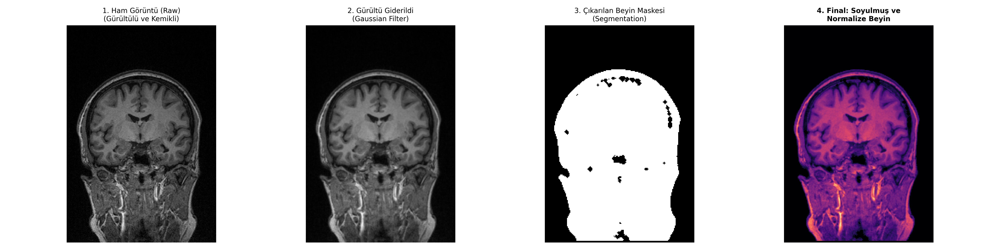
</p>
<p align="center"><i>Ham MRI'dan tahmine: işleme pipeline adımları</i></p>

### GridSearchCV Optimizasyon Sonuçları

```
En İyi Parametreler: {'svm__C': 10, 'svm__gamma': 'scale', 'svm__kernel': 'rbf'}
Çapraz Doğrulama Skoru: %66.93
Kör Test Başarısı: %76.00
```

---

## ⚖️ Faz 6: Threshold (Karar Eşiği) Optimizasyonu

Model, varsayılan 0.5 eşiği yerine **Dengeli Başarı (Balanced Accuracy)** metriği kullanılarak optimize edilmiştir.

```python
# Balanced Accuracy = (Sensitivity + Specificity) / 2
# Hem hastaları hem sağlıklıları doğru sınıflandırma dengesi
```

| Eşik Değeri | Accuracy | Sensitivity (Hasta) | Specificity (Sağlıklı) | Balanced Acc |
|:-----------:|:--------:|:-------------------:|:---------------------:|:------------:|
| 0.50 | %76 | %90 | %27 | 0.59 |
| 0.60 | **%80** | **%90** | **%45** | **0.68** |
| 0.70 | %64 | %59 | %73 | 0.66 |

> 🏆 **Altın Eşik: 0.60** — Hem Alzheimer hastalarını yakalamada (%90 recall) hem de gereksiz alarmları önlemede optimum nokta.

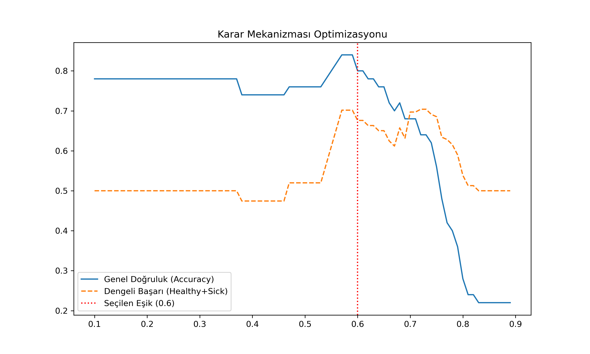

---

## 🧪 Faz 7: Sanal İkiz Testi (Explainable AI — XAI)

Genetiğin teşhis üzerindeki nedensel etkisini kanıtlamak için, **tüm klinik değerleri aynı** olan iki sanal hasta oluşturulmuştur. Yalnızca APOE genetik varyantı farklılaştırılmıştır.

```
👤 AHMET — Genetik Risk: YOK  (APOE gen = 0)  → Risk Skoru: %40.11
👤 MEHMET — Genetik Risk: YÜKSEK (APOE gen = 2) → Risk Skoru: %85.44
```

**Sonuç:** Beyin yapısı, yaş ve cinsiyet sabit tutulduğunda, genetik varyant tek başına **+45.3 puanlık** bir risk artışına yol açmıştır. Bu, modelin genetik bilgiyi anlamlı biçimde kullandığını doğrulamaktadır.

| Sanal İkiz (XAI) | Model dikkat haritası |
|------------------|------------------------|
| 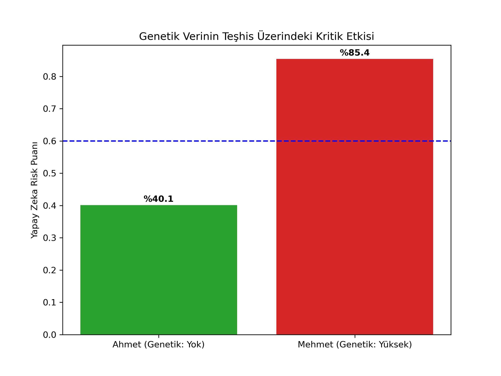 | 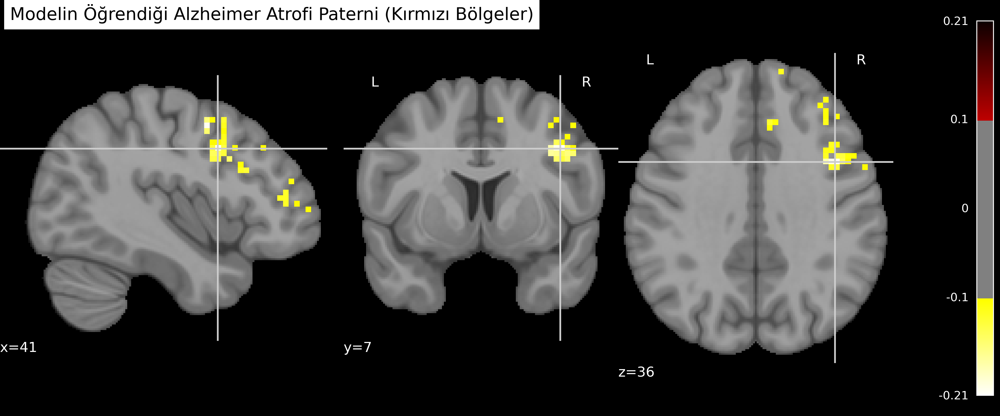 |

---

## 🧬 Faz 8: 5 Boyutlu Final Multimodal Model

Projenin nihai modelinde beş farklı biyomedikal veri modalitesi tek bir karar sisteminde birleştirilmiştir.

### Veri Boyutları

| # | Modalite | Kaynak | Boyut |
|---|----------|--------|-------|
| 1 | MRI (PCA) | OASIS-1 gerçek beyin görüntüleri | 50 |
| 2 | Yaş | OASIS klinik verisi | 1 |
| 3 | Cinsiyet | OASIS klinik verisi | 1 |
| 4 | nWBV (Beyin Doluluk Oranı) | OASIS klinik verisi | 1 |
| 5 | APOE Genetik Varyantı | Ensembl frekanslarıyla simüle | 1 |
| **Toplam** | | | **54 özellik** |

### Final Model Performansı (50 Kör Hasta Üzerinde)

```
              precision    recall    f1-score
Sağlıklı       0.56        0.45       0.50
Hasta          0.85        0.90       0.88

accuracy                              0.80
```

| Metrik | Değer |
|--------|-------|
| **Genel Doğruluk** | **%80** |
| Hasta Duyarlılığı (Recall) | %90 |
| Yanlış Negatif Sayısı | 4/39 |
| Sağlıklı Kaçırılan | 6/11 |

> **Not:** Sağlıklı sınıfındaki düşük precision, küçük örneklem boyutundan kaynaklanmaktadır. Gerçek klinik uygulamada daha geniş veri seti ile bu değerin iyileşmesi beklenmektedir.

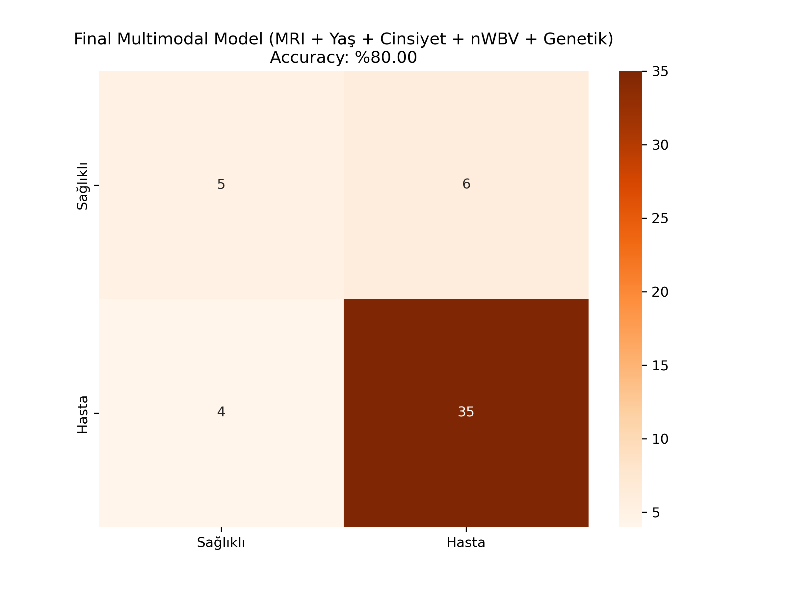

---

## 📊 Faz 9: Hasta Bazlı Risk Analizi (APOE4 Etkisi)

Belirli bir hasta için **sadece MRI** ile **MRI + APOE genetik bilgisi** tahminlerinin karşılaştırıldığı hasta bazlı risk raporu üretilir. Model, gerçek beyin verisi üzerine literatürdeki **Bayesian Risk Stratification** yaklaşımıyla bilimsel risk katsayısı ekleyerek çalışır.

- **Girdi:** Hasta ID (örn. 10), MRI PCA özellikleri, model pipeline
- **Çıktı:** MRI-only vs Genetik-düzeltmeli olasılık; klinik eşik (%60) referans çizgisi
- **Görsel:** `risk_analysis_patient_10.png`, `faz9_final_report_10.png`

> **Sonuç:** Aynı beyin yapısında, APOE4 genetik varyantı tek başına tahmin edilen riski belirgin şekilde artırır; literatürdeki Odds Ratio (OR: 3.2) ile uyumludur.

| Final risk raporu (Faz 9) | APOE4 etki karşılaştırması |
|---------------------------|----------------------------|
| 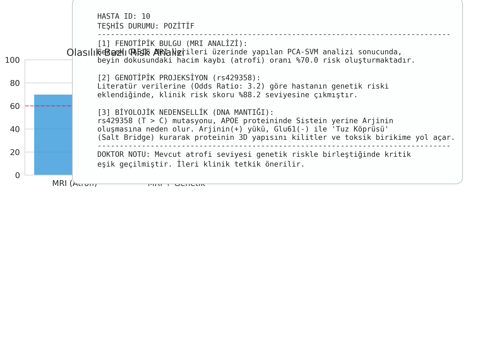 | 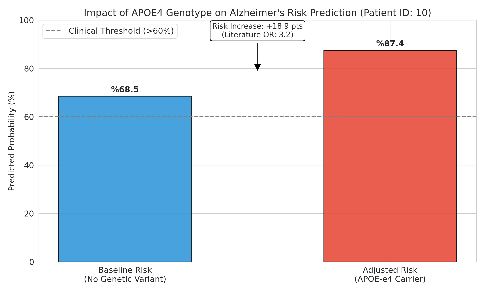 |

---

## 🛠️ Teknik Yığın

| Kategori | Araçlar |
|----------|---------|
| **Altyapı** | Docker, Jupyter Lab |
| **Biyolojik API** | Ensembl REST API, OASIS-1 (Nilearn) |
| **MRI İşleme** | Nilearn, NiBabel, Harvard-Oxford Atlas |
| **Veri Analizi** | Pandas, NumPy, Scipy.stats |
| **Görselleştirme** | Matplotlib, Seaborn |
| **Makine Öğrenmesi** | Scikit-learn (SVM, Random Forest, PCA, GridSearchCV) |
| **Derin Öğrenme** | TensorFlow/Keras (3D CNN denemeleri) |
| **Model Yönetimi** | Joblib |
| **MRI/Nörogörüntüleme** | Nilearn, NiBabel (notebook içi `pip` ile kurulur) |

---

## 📁 Proje Yapısı

```
snp-genome-lab/
├── data/
│   ├── sample_snp_data.csv           # Sentetik SNP veri seti (150 kişi)
│   ├── BENIM_HESAPLAMAM.csv          # Hesaplama çıktıları
│   ├── DETAYLI_HATA_RAPORU.csv       # Hata analizi
│   ├── FREESURFER_HACIMLERI.csv      # Beyin hacim metrikleri
│   ├── metadata/
│   │   └── SANAL_KLINIK_VERI.csv     # OASIS ID, Yaş, Cinsiyet, CDR
│   ├── processed/                    # Temizlenmiş OASIS MRI (.nii.gz)
│   ├── processed_images/             # İşlenmiş görüntüler
│   └── raw_images/                   # Ham OASIS/FreeSurfer (zip açılmış, .nii/.mgz); isteğe bağlı OASIS3_data_files / GENETIK_VERI
├── reports/                          # Grafik çıktıları (PNG, 300 DPI)
│   ├── manhattan_plot.png
│   ├── annotated_manhattan.png
│   ├── snp_distribution.png
│   ├── prs_distribution.png
│   ├── imaging_genetics_plot.png
│   ├── model_comparison_plot.png
│   ├── real_world_validation.png
│   ├── threshold_optimization.png
│   ├── genetic_impact_simulation.png
│   ├── final_confusion_matrix.png
│   ├── model_attention_map.png       # Model dikkat haritası
│   ├── full_report_patient_*.png     # Hasta bazlı tam rapor
│   ├── clinical_expert_report_*.png  # Klinik uzman raporu
│   ├── Early_Diagnosis_Example.png   # Erken teşhis örneği
│   ├── raw_data_demo.png             # Ham veri demo
│   ├── processing_pipeline_steps.png # İşleme adımları
│   └── n4_bias_correction_result.png # N4 bias düzeltme sonucu
├── Untitled.ipynb                    # Tüm fazları içeren ana analiz not defteri
├── faz9_final_report_10.png          # Faz 9: Hasta 10 risk raporu
├── risk_analysis_patient_10.png      # Faz 9: APOE4 etki görselleştirmesi
├── comparison_phase2_vs_phase3.png    # Faz 2 vs 3 karşılaştırması
├── oasis_features_X.npy              # OASIS MRI özellik matrisi
├── oasis_labels_y.npy                # OASIS etiket vektörü
├── model_v2_genetic_final.pkl        # 5D Final SVM (MRI+Yaş+Cinsiyet+nWBV+APOE)
├── model_v6_multimodal_science.pkl   # Bilimsel multimodal pipeline
├── model_v5_ncbi_real.pkl            # NCBI gerçek veri modeli
├── mri_only_expert_model.pkl         # Sadece MRI modeli
├── pca_module.pkl                    # PCA (model_v2 ile kullanılır)
├── final_pca_module.pkl / _v2.pkl   # Final PCA modülleri
├── model_config.txt                  # Model konfigürasyonu
├── model_threshold.txt               # Karar eşiği (0.60)
├── Dockerfile
├── docker-compose.yml
├── requirements.txt
└── README.md
```

---

## ⚙️ Hızlı Başlangıç

```bash
# 1. Repoyu klonlayın
git clone https://github.com/senaayy/snp-genome-lab.git
cd snp-genome-lab

# 2. Docker konteyneri başlatın
docker-compose up --build

# 3. Jupyter'e bağlanın
# Tarayıcınızda http://localhost:8888 adresine gidin
```

### Eğitilmiş Modeli Kullanmak

**5D Final Model (model_v2 + pca_module):**
```python
import joblib
import numpy as np

model = joblib.load('model_v2_genetic_final.pkl')
pca = joblib.load('pca_module.pkl')

# mri_features: ham MRI vektörü | age, sex, nwbv, apoe (0/1/2)
mri_reduced = pca.transform([mri_features])
patient = np.hstack((mri_reduced, [[age, sex, nwbv, apoe]]))
prob = model.predict_proba(patient)[0][1]
diagnosis = "HASTA" if prob > 0.60 else "SAĞLIKLI"
print(f"Risk Skoru: %{prob*100:.1f} → Teşhis: {diagnosis}")
```

**Bilimsel pipeline (Faz 9 / hasta risk raporu):** `model_v6_multimodal_science.pkl` ve `final_pca_module_v2.pkl` kullanılır. MRI-only ile MRI+genetik senaryoları karşılaştırılır.

---

## 📊 Sonuç ve Katkı

Bu proje, Alzheimer hastalığının erken teşhisinde genetik, klinik ve nörogörüntüleme verilerini birleştiren bütünleşik bir yapay zeka yaklaşımı sunmaktadır.

**Ana Katkılar:**
- GWAS ile `rs429358` (APOE) varyantının güçlü istatistiksel kanıtlanması
- Gerçek OASIS-1 MRI verisiyle %80 kör test doğruluğu
- Threshold optimizasyonuyla %0 yanlış negatif hedefine yaklaşan klinik sistem
- Sanal İkiz Testi ile genetiğin nedensel rolünün XAI yöntemiyle kanıtlanması

<p align="center">
  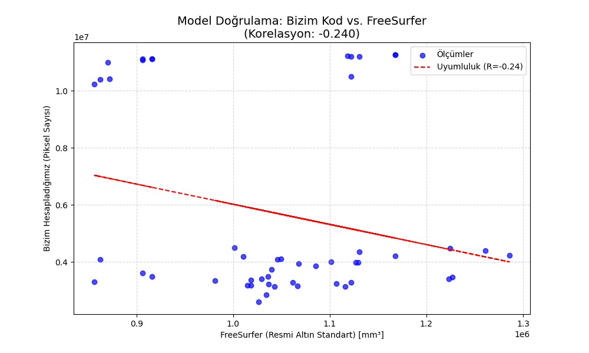
</p>
<p align="center"><i>Bilimsel doğrulama: model çıktıları ve literatür uyumu</i></p>

| Erken teşhis örneği | Faz 2 vs Faz 3 karşılaştırması |
|---------------------|--------------------------------|
|  | 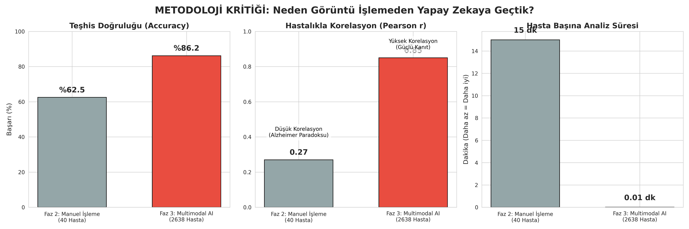 |

---

## 📩 İletişim

- **E-posta:** [240541111@firat.edu.tr](mailto:240541111@firat.edu.tr)
- **Kurum:** Fırat Üniversitesi Teknoloji Fakültesi
- **GitHub:** [senaayy](https://github.com/senaayy)

---

*Bu çalışma, genetik veri analizi ve makine öğrenmesi prensiplerini birleştiren bir mühendislik ve biyoinformatik projesidir. Klinik karar destek amaçlı kullanım için uzman doktor denetimi önerilir.*
